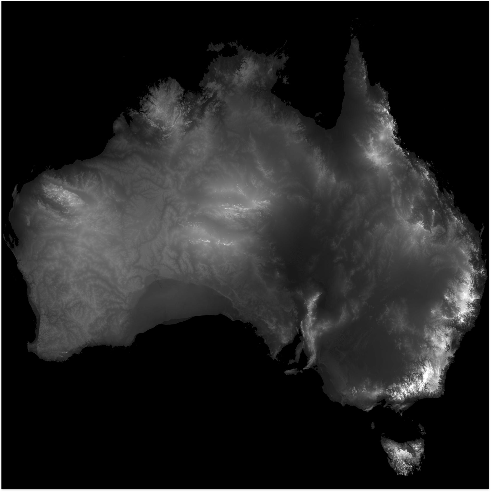
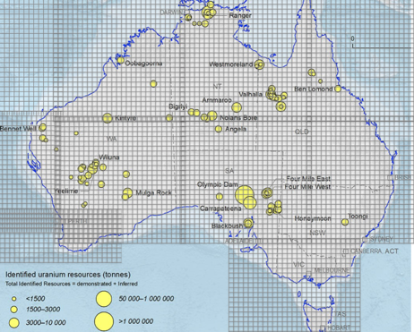

##  Predicting uranium deposits size by observed indicators

### Problem

1) the "on ground" researches are very expensive and time-consuming

### Solution

1) we will create tool for uranium deposit size prediction bsed on observed
indicators

### Dataset

At first stage we define list of domains, from where we can receive the data

1) soil composition [link](https://www.fao.org/soils-portal/data-hub/soil-maps-and-databases/harmonized-world-soil-database-v12/en/)
2) height of the surface [link](http://maps.google.com)
3) earthquaqes [link](https://public.opendatasoft.com/explore/dataset/significant-earthquake-database/table/?location=8,41.81636,46.7688&basemap=jawg.light)
1) Uranium deposits australia only png [link](https://www.ga.gov.au/digital-publication/aecr2021/uranium-and-thorium)
1) Thorium depositsaustralia only png [link](https://www.ga.gov.au/digital-publication/aecr2021/uranium-and-thorium)
1) historical weather api [link](https://open-meteo.com/en/docs/historical-weather-api#location_mode=csv_coordinates&timezone=Asia%2FBangkok)
2) Uranium deposits usa [link1](https://www.arcgis.com/home/item.html?id=1ddc80916bb742cfb439fef2cfe56b8d), [link2](https://www.sciencebase.gov/catalog/item/5d1ce678e4b0941bde64cd71)
3) canada no areas [link](https://world-nuclear.org/information-library/country-profiles/countries-a-f/canada-uranium.aspx), only mines no areas [link](https://open.canada.ca/data/en/dataset/ce375e21-8893-11e0-8e6c-6cf049291510)

### Problems

With each source of data there are a lot of problems, which in general don't allow to
create dataset with proper quality

#### Soil composition 

The first source was the [Harmonized soil database](https://www.fao.org/soils-portal/data-hub/soil-maps-and-databases/harmonized-world-soil-database-v12/en/).
The map contains good level of global detalization, but there are a lot of problems 
in small regions. For example, for Armenia there are only 4 types of soils, but in reality there are 
more types

If we use the typical soil composition maps, we will see that there is no unification. There are soil types, that
Armenia has and Australia doesn't and vice versa. 

Also it is unclear how to transfer the soil maps from png to discrete system. 

#### Height of the surface

The first idea to get the height maps was using using google maps, but was too
complicated to understand the google maps api 

Then was proposed to use typical height map, where the pixel with value 0 is 0 level 
above the ocean and the pixel with value 255 is the highest point of the country. 

The main advantage of this method is that the map is already descretised and there is
no need to transfer data manually

#### Earthquaqes

In general, there is one good earthquaqes map from OpendataSoft, but there is one
disadvantage - on the map are displayed the only the strongest earthquaqes, which 
are not very much. 

#### Uranium deposits

As the uranium and other radioactive deposits are strategic resources, there are no 
counties who prove non-zero size datasets about the sizes and locations of deposits. 
In general, countries provide handmade maps, where the deposits are marked. 

Unfortunately, if you find any suitable dataset or map, you will not be able to 
evaluate the real size of deposit. It may be, that on big area there a 1 gram of 
uranium ore or on small area almost endless amount of ore

#### Discretization 

To use the map's like data we need to transfer data from png image to some discrete
grid. The first idea was to  create grid, transfer it in map and then mark
the coordinates of deposits. 

The experiment shows that this method is very time-consuming and has low accuracy 
as the human could make mistake 

### Results

Research shows, that it is very difficult and sometimes almost impossible 
to create dataset based on quasi-opened data. 
The is no county in the world that openly distributes the strategic resources data.
Furthemore, it's not clearn how to transfer data from resources maps to discrete grid
without big losses

Also it is complicated to create dataset from more then 3 domains. As a result - 
dataset wasn't created.
